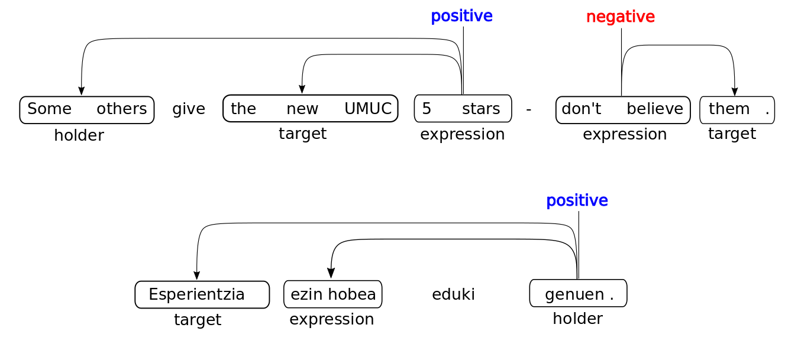

## SemEval-2022 Shared Task 10: Structured Sentiment Analysis

This Github repository hosts the data and baseline models for the [SemEval-2022 shared task 10](https://competitions.codalab.org/competitions/33556) on structured sentiment. In this repository you will find the datasets, baselines, and other useful information on the shared task.


## LATEST NEWS

**20.02.22**: The [OpenReview instance for SemEval](https://openreview.net/group?id=aclweb.org/NAACL/2022/Workshop/Semeval) is now available. You can submit your system description papers here by Feb 28. Remeber tht for SemEval 2022 all deadlines are 23:59 UTC-12 ("anywhere on Earth").

**4.02.22**: Evaluation period has finished. We encourage all participants to submit a system description paper (more info to come), deadline is February 28th. [Guidelines from SemEval](https://semeval.github.io/paper-requirements.html). If you do submit, please cite the [Shared Task Description and datasets](#citation).

**11.01.2022**: Added test data for the evaluation phase. Additionally, we corrected the problems associated with issue #9 in train, dev, and test splits. We've also updated the example_submission.zip in the evaluation subrepo for the evaluation phase. Therefore, we recommend you pull the changes.

**09.12.2021**: Updated the evaluation script on codalab, as previous versions gave incorrectly low results when run on codalab due to floor division in python 2.7 (codalab still runs on python 2, see issue #16).

**29.11.2021**: Updated MPQA processing script to remove annotations with no polarity (see issue #20). If you have the data from before this date, you will need to rerun the preprocessing scripts.

**15.11.2021**: Updated Darmstadt and MPQA processing script to remove annotations which contain polar expessions with incorrect offsets, giving errors during evaluation (see issue #17). If you have the data from before this date, you will need to rerun the preprocessing scripts.

**15.10.2021**: Updated Darmstadt processing script to remove annotations which contain polar expessions with no offset (see issue #9).

**6.10.2021**: Updated MPQA and Darmstadt dev data on the codalab. You may need to check your data to make sure that you're working with the newest version in order to submit.

## Table of contents:

1. [Problem description](#problem-description)
2. [Subtasks](#subtasks)
   1. [Monolingual](#monolingual)
      1. [Data](#data)
   2. [Cross-lingual](#cross-lingual)
3. [Evaluation](#evaluation)
4. [Data format](#data-format)
5. [Resources](#resources)
6. [Submission via Codalab](#submission-via-codalab)
7. [Baselines](#baselines)
8. [Important dates](#important-dates)
9. [Frequently Asked Questions](#frequently-asked-questions)
10. [Task organizers](#task-organizers)
11. [Citation](#citation)

## Problem description

The task is to predict all structured sentiment graphs in a text (see the examples below). We can formalize this as finding all the opinion tuples *O* = *O*<sub>i</sub>,...,*O*<sub>n</sub> in a text. Each opinion *O*<sub>i</sub> is a tuple *(h, t, e, p)*

where *h* is a **holder** who expresses a **polarity** *p* towards a **target** *t* through a **sentiment expression** *e*, implicitly defining the relationships between the elements of a sentiment graph.

The two examples below (first in English, then in Basque) give a visual representation of these *sentiment graphs*.



Participants can then either approach this as a sequence-labelling task, or as a graph prediction task.

## Subtasks
### Monolingual
This track assumes that you train and test on the same language. Participants will need to submit results for seven datasets in five languages.

 The datasets can be found in the [data](./data) directory.

#### Data

| Dataset | Language | # sents | # holders | # targets | # expr. |
| --------| -------- | ------- | --------- | --------- | ------- |
| [NoReC_fine](https://aclanthology.org/2020.lrec-1.618/) | Norwegian | 11437 | 1128|8923 |11115 |
| [MultiBooked_eu](https://aclanthology.org/L18-1104/) | Basque |1521 |296 |1775 |2328 |
| [MultiBooked_ca](https://aclanthology.org/L18-1104/) | Catalan |1678 |235 |2336 |2756 |
| [OpeNER_es](http://journal.sepln.org/sepln/ojs/ojs/index.php/pln/article/view/4891) | Spanish |2057 |255 |3980 |4388 |
| [OpeNER_en](http://journal.sepln.org/sepln/ojs/ojs/index.php/pln/article/view/4891) | English |2494 |413 |3850 |4150 |
| [MPQA](http://mpqa.cs.pitt.edu/) | English | 10048 | 2279| 2452 | 2814 |
| [Darmstadt_unis](https://tudatalib.ulb.tu-darmstadt.de/handle/tudatalib/2448) | English | 2803 | 86 | 1119 | 1119 |

### Cross-lingual
This track will explore how well models can generalize across languages. The test data will be the `MultiBooked Datasets (Catalan and Basque)` and the `OpeNER Spanish` dataset. For training, you can use any of the other datasets, as well as any other resource that does not contain sentiment annotations in the target language.

This setup is often known as zero-shot cross-lingual transfer and we will assume that all submissions follow this format.


## Evaluation

The two subtasks will be evaluated separately. In both tasks, the evaluation will be based on [Sentiment Graph F<sub>1</sub>](https://arxiv.org/abs/2105.14504).


This metric defines true positive as an *exact match* at
graph-level, *weighting the overlap* in predicted and
gold spans for each element, averaged across all
three spans.

For *precision* we weight the number
of correctly predicted tokens divided by the total
number of predicted tokens (for *recall*, we divide
instead by the number of gold tokens), allowing
for empty holders and targets which exist in the gold standard.


 The leaderboard for each dataset, as well as the average of all 7. The winning submission will be the one that has the highest average Sentiment Graph F<sub>1</sub>.


## Data format

We provide the data in json lines format.

Each line is an annotated sentence, represented as a dictionary with the following keys and values:

* `'sent_id'`: unique sentence identifiers

* `'text'`: raw text version of the previously tokenized sentence

* `opinions'`: list of all opinions (dictionaries) in the sentence

Additionally, each opinion in a sentence is a dictionary with the following keys and values:

* `'Source'`: a list of text and character offsets for the opinion holder

* `'Target'`: a list of text and character offsets for the opinion target

* `'Polar_expression'`: a list of text and character offsets for the opinion expression

* `'Polarity'`: sentiment label ('Negative', 'Positive', 'Neutral')

* `'Intensity'`: sentiment intensity ('Average', 'Strong', 'Weak')


```
{
    "sent_id": "../opener/en/kaf/hotel/english00164_c6d60bf75b0de8d72b7e1c575e04e314-6",

    "text": "Even though the price is decent for Paris , I would not recommend this hotel .",

    "opinions": [
                 {
                    "Source": [["I"], ["44:45"]],
                    "Target": [["this hotel"], ["66:76"]],
                    "Polar_expression": [["would not recommend"], ["46:65"]],
                    "Polarity": "Negative",
                    "Intensity": "Average"
                  },
                 {
                    "Source": [[], []],
                    "Target": [["the price"], ["12:21"]],
                    "Polar_expression": [["decent"], ["25:31"]],
                    "Polarity": "Positive",
                    "Intensity": "Average"}
                ]
}
```

You can import the data by using the json library in python:

```
>>> import json
>>> with open("data/norec/train.json") as infile:
            norec_train = json.load(infile)
```

## Resources:
The task organizers provide training data, but participants are free to use other resources (word embeddings, pretrained models, sentiment lexicons, translation lexicons, translation datasets, etc). We do ask that participants document and cite their resources well.

We also provide some links to what we believe could be helpful resources:

1. [pretrained word embeddings](http://vectors.nlpl.eu/repository/)
2. [pretrained language models](https://huggingface.co/models)
3. [translation data](https://opus.nlpl.eu/)
4. [sentiment resources](https://github.com/jerbarnes/sentiment_resources)
5. [syntactic parsers](https://stanfordnlp.github.io/stanza/)


## Submission via Codalab
Submissions will be handled through our [codalab competition website](https://competitions.codalab.org/competitions/33556).

## Baselines

The task organizers provide two baselines: one that takes a sequence-labelling approach and a second that converts the problem to a dependency graph parsing task. You can find both of them in [baselines](./baselines).

## Important dates

   - Training data ready: September 3, 2021
   - Evaluation data ready: December 3, 2021
   - Evaluation start: January 10, 2022
   - Evaluation end: by January 31, 2022
   - Paper submissions due:  February 28, 2022
   - Notification to authors: March 31, 2022


## Frequently asked questions

Q: How do I participate?

A: Sign up at our [codalab website](https://competitions.codalab.org/competitions/33556), download the [data](./data), train the [baselines](./baselines) and submit the results to the codalab website.

Q: Can I run the graph parsing baseline on GPU?

A: The code is not set up to run on GPU right now, but if you want to implement it and issue a pull request, we'd be happy to incorporate that into the repository.


## Task organizers

* Corresponding organizers
    * [Jeremy Barnes](https://jerbarnes.github.io/): contact for info on task, participation, etc. (<jeremycb@ifi.uio.no>)
    * [Andrey Kutuzov](https://www.mn.uio.no/ifi/english/people/aca/andreku/index.html): <andreku@ifi.uio.no>
* Organizers
    * Jan Buchman
    * Laura Ana Maria Oberländer
    * Enrica Troiano
    * Rodrigo Agerri
    * Lilja Øvrelid
    * Erik Velldal
    * Stephan Oepen

[Mailing list (Google group) for the task](mailto:structured-sent-participants@googlegroups.com)


## Citation

If you use the baselines or data from this shared task, please cite the following paper, as well as the papers for the specific datasets that you use (see the bib files that follow afterwards) :

```
@inproceedings{barnes-etal-2022-semeval,
    title = "{S}em{E}val-2022 Task 10: Structured Sentiment Analysis",
    author = "Barnes, Jeremy and
              Oberl{\"a}nder, Laura Ana Maria and
              Troiano, Enrica and
              Kutuzov, Andrey and
              Buchmann, Jan and
              Agerri, Rodrigo and
              {\O}vrelid, Lilja  and
              Velldal, Erik",
    booktitle = "Proceedings of the 16th International Workshop on Semantic Evaluation (SemEval-2022)",
    month = july,
    year = "2022",
    address = "Seattle",
    publisher = "Association for Computational Linguistics"
}
```

For the specific datasets, use the following:

1. NoReC

```
@inproceedings{ovrelid-etal-2020-fine,
    title = "A Fine-grained Sentiment Dataset for {N}orwegian",
    author = "{\O}vrelid, Lilja  and
      M{\ae}hlum, Petter  and
      Barnes, Jeremy  and
      Velldal, Erik",
    booktitle = "Proceedings of the 12th Language Resources and Evaluation Conference",
    month = may,
    year = "2020",
    address = "Marseille, France",
    publisher = "European Language Resources Association",
    url = "https://aclanthology.org/2020.lrec-1.618",
    pages = "5025--5033",
    abstract = "We here introduce NoReC{\_}fine, a dataset for fine-grained sentiment analysis in Norwegian, annotated with respect to polar expressions, targets and holders of opinion. The underlying texts are taken from a corpus of professionally authored reviews from multiple news-sources and across a wide variety of domains, including literature, games, music, products, movies and more. We here present a detailed description of this annotation effort. We provide an overview of the developed annotation guidelines, illustrated with examples and present an analysis of inter-annotator agreement. We also report the first experimental results on the dataset, intended as a preliminary benchmark for further experiments.",
    language = "English",
    ISBN = "979-10-95546-34-4",
}
```

2. MultiBooked

```
@inproceedings{barnes-etal-2018-multibooked,
    title = "{M}ulti{B}ooked: A Corpus of {B}asque and {C}atalan Hotel Reviews Annotated for Aspect-level Sentiment Classification",
    author = "Barnes, Jeremy  and
      Badia, Toni  and
      Lambert, Patrik",
    booktitle = "Proceedings of the Eleventh International Conference on Language Resources and Evaluation ({LREC} 2018)",
    month = may,
    year = "2018",
    address = "Miyazaki, Japan",
    publisher = "European Language Resources Association (ELRA)",
    url = "https://aclanthology.org/L18-1104",
}
```

3. OpeNER

```
@inproceedings{Agerri2013,
author = {Agerri, Rodrigo and Cuadros, Montse and Gaines, Sean and Rigau, German},
booktitle = {Sociedad Espa{\~{n}}ola para el Procesamiento del Lenguaje Natural},
pages = {215--218},
title = {{OpeNER: Open polarity enhanced named entity recognition.}},
volume = {51},
year = {2013}
}
```


4. MPQA

```
@article{Wiebe2005b,
author = {Wiebe, Janyce
        and Wilson, Theresa
        and Cardie, Claire},
journal = {Language Resources and Evaluation},
number = {2-3},
pages = {165--210},
title = {{Annotating expressions of opinions and emotions in language}},
volume = {39},
year = {2005}
}
```

5. Darmstadt Service Reviews

```
@inproceedings{toprak-etal-2010-sentence,
    title = "Sentence and Expression Level Annotation of Opinions in User-Generated Discourse",
    author = "Toprak, Cigdem  and
      Jakob, Niklas  and
      Gurevych, Iryna",
    booktitle = "Proceedings of the 48th Annual Meeting of the Association for Computational Linguistics",
    month = jul,
    year = "2010",
    address = "Uppsala, Sweden",
    publisher = "Association for Computational Linguistics",
    url = "https://aclanthology.org/P10-1059",
    pages = "575--584",
}
```

