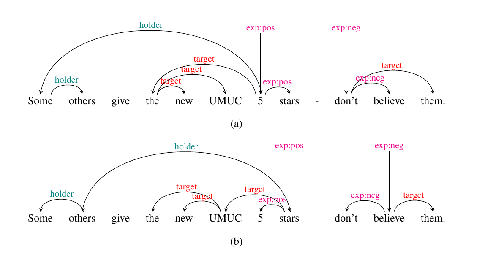

## Structured Sentiment as Dependency Graph Parsing baseline

This subrepository contains the code and datasets described in following paper: [Structured Sentiment Analysis as Dependency Graph Parsing](https://aclanthology.org/2021.acl-long.263/).

Rather than treating the sentiment graph prediction task as sequence-labeling, we can treat it as a bilexical dependency graph prediction task, although some assumptions must be made. The two most basic versions (a) *head-first* and (b) *head-final*, are shown below:



In the case of *head-first*, we assume that the first token in any subelement (sentiment holder, target, or expression) is the *head*. This means any incoming arcs from other subelements will point to this token, as well as all internal arcs. *Head-final* instead assumes the final token is the head. The conversion script (convert_to_conllu.py) also allows adding separate label prefix for internal arcs (--inside_label), using dependency edges (--use_dep_edges) or dependency labels (--use_dep_labels) to create more linguistically plausable graphs. The base version used in get_baseline.sh is *head-final*, but you can change this to experiment on other graph representations.

Finally, the model is a variation of the [Dozat and Manning parser](https://openreview.net/forum?id=Hk95PK9le) which was implemented in the paper [End-to-End Negation Resolution as Graph Parsing](https://aclanthology.org/2020.iwpt-1.3/). You can find further details on the model in this paper and [Structured Sentiment Analysis as Dependency Graph Parsing](https://aclanthology.org/2021.acl-long.263/).

## Requirements

1. python3
2. pytorch
3. matplotlib
4. sklearn
5. gensim
6. stanza
7. nltk

## Get the baseline models

In order to train the baseline models, we provide scripts which will download pretrained embeddings, convert the json data to conllu format, and train monolingual models:

```
bash ./get_baseline.sh
```

The models will be saved as pytorch models in /experiments under the name best_model.save. You can then use the inference.sh script to use the models to predict on unseen data:

```
bash ./inference.sh sentiment_graphs/multibooked_eu/head_final/dev.conllu experiments/multibooked_eu/head_final/ embeddings/32.zip
```

The predictions (dev.conllu.pred, dev.conllu.json) will be written to the same directory where the model is found. The json files contain the predictions converted to the appropriate submission format, while the conllu.pred files show the actual predictions.

## Suggested reading

```
@inproceedings{barnes-etal-2021-structured,
    title = "Structured Sentiment Analysis as Dependency Graph Parsing",
    author = "Barnes, Jeremy  and
      Kurtz, Robin  and
      Oepen, Stephan  and
      {\O}vrelid, Lilja  and
      Velldal, Erik",
    booktitle = "Proceedings of the 59th Annual Meeting of the Association for Computational Linguistics and the 11th International Joint Conference on Natural Language Processing (Volume 1: Long Papers)",
    month = aug,
    year = "2021",
    address = "Online",
    publisher = "Association for Computational Linguistics",
    url = "https://aclanthology.org/2021.acl-long.263",
    doi = "10.18653/v1/2021.acl-long.263",
    pages = "3387--3402",
    abstract = "Structured sentiment analysis attempts to extract full opinion tuples from a text, but over time this task has been subdivided into smaller and smaller sub-tasks, e.g., target extraction or targeted polarity classification. We argue that this division has become counterproductive and propose a new unified framework to remedy the situation. We cast the structured sentiment problem as dependency graph parsing, where the nodes are spans of sentiment holders, targets and expressions, and the arcs are the relations between them. We perform experiments on five datasets in four languages (English, Norwegian, Basque, and Catalan) and show that this approach leads to strong improvements over state-of-the-art baselines. Our analysis shows that refining the sentiment graphs with syntactic dependency information further improves results.",
}
```
